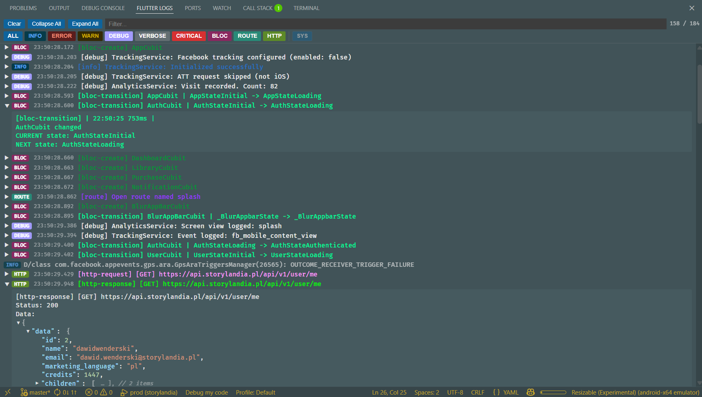

<p align="center">
  
</p>

<h1 align="center">Flutter Log Fold</h1>

<p align="center">
  Foldable, filterable log viewer for Flutter debug sessions.
</p>

Flutter's Debug Console is hard to work with once your app starts logging seriously. Long multi-line blocks from Talker or Dio bury the output you actually care about, searching through walls of text is painful, and reading a JSON response means scrolling through dozens of unformatted lines. This extension fixes that.

**Flutter Log Fold** replaces the noisy Debug Console with a dedicated **Flutter Logs** panel. Originally built to tame [Talker](https://pub.dev/packages/talker) output, it grew into a full-featured log viewer with block folding, category filtering, JSON trees, and ANSI color support — compatible with multiple Flutter logging libraries.



## Features

### Foldable log blocks

Multi-line log blocks (Talker's box-drawing `┌│└` output, etc.) are detected and collapsed into **single-line summaries**. Click to expand and see full block content. Plain single-line logs are displayed inline without folding.

### Filtering and search

- **Severity chips** — toggle INFO, ERROR, WARN, DEBUG, VERBOSE, CRITICAL on/off
- **Custom tag chips** — tags like `[bloc-transition]`, `[route]`, `[http-request]` are auto-detected from incoming logs and get their own color-coded filter chips
- **Text search** — case-insensitive live filter with a visible counter (`X / Y`)
- **System log toggle** — show/hide Android system logs (Choreographer, BillingClient, etc.) via the SYS chip
- **ALL chip** — toggle all categories at once

### JSON tree rendering

JSON objects and arrays found inside log blocks are rendered as **collapsible, syntax-highlighted trees** with theme-aware colors (dark, light, and high-contrast themes). Top two levels are expanded by default, deeper levels are collapsed.

Handles truncated JSON gracefully — logcat's ~4096-char line limit splits long strings, which the extension detects and marks with `[CROPPED]`.

### Talker formatters

Built-in formatters condense verbose Talker block output into concise one-liners:

| Tag | Before | After |
|-----|--------|-------|
| `bloc-transition` | Multi-line block with timestamps | `[bloc-transition] MyCubit \| OldState -> NewState` |
| `bloc-create` | Multi-line block | `[bloc-create] MyCubit` |
| `bloc-close` | Multi-line block | `[bloc-close] MyCubit` |
| `route` | Block with timestamps | `[route] Open route named home` |
| Other tags | Block with `\| HH:MM:SS xxxms \|` header | `[tag] message` (timestamp stripped) |

Each formatter can be individually enabled/disabled in settings.

### ANSI color support

Full ANSI color rendering — 8-color, bright, 256-color palette, and RGB — using VS Code's terminal theme variables for consistent look. Supports bold, dim, italic, and underline formatting. Colors are preserved in formatted block summaries.

### Multiple logging library presets

| Preset | Libraries | Block markers |
|--------|-----------|---------------|
| **talker** (default) | talker, talker_flutter, talker_dio_logger | `┌ │ └` |
| **pretty** | pretty_dio_logger, logger | `╔ ║ ╚` |
| **custom** | Any format | User-defined markers |

### Other

- **Auto-open** — log panel opens automatically when a Flutter debug session starts
- **Timestamps** — HH:MM:SS.mmm on every block entry
- **Smart auto-scroll** — stays at bottom for new logs, but respects manual scroll position
- **Collapse All / Expand All** — toolbar buttons to fold/unfold all blocks at once
- **Configurable buffer** — keep 50 to 10,000 log entries (oldest are removed)
- **Android prefix stripping** — automatically removes `I/flutter (PID):` prefixes
- **Custom line stripping** — optional regex to remove any per-line prefix before parsing
- **Live settings** — all configuration changes apply immediately without restart

## Commands

| Command | Description |
|---------|-------------|
| `Flutter Logs: Show Panel` | Open / focus the log panel |
| `Flutter Logs: Clear` | Clear all logs |

## Settings

All settings are under the `flutterLogFold.*` namespace.

| Setting | Default | Description |
|---------|---------|-------------|
| `autoOpen` | `true` | Auto-open log panel when a debug session starts |
| `collapseByDefault` | `true` | Collapse new log blocks by default |
| `maxLogs` | `500` | Max log entries in buffer (50–10,000) |
| `preset` | `"talker"` | Block pattern preset: `talker`, `pretty`, or `custom` |
| `blockStart` | `"┌──"` | Custom block start marker (only with `custom` preset) |
| `blockEnd` | `"└──"` | Custom block end marker (only with `custom` preset) |
| `blockContentPrefix` | `"│"` | Content prefix to strip (only with `custom` preset) |
| `talkerBlocFormat` | `true` | Condense bloc-transition/create/close into one-liners |
| `talkerRouteFormat` | `true` | Condense route observer blocks into one-liners |
| `talkerStripTimestamp` | `true` | Strip Talker timestamps from other tag summaries |
| `lineStripPattern` | `""` | Regex to strip from every line before block detection |

## Supported logging libraries

- [talker](https://pub.dev/packages/talker) / [talker_flutter](https://pub.dev/packages/talker_flutter) / [talker_dio_logger](https://pub.dev/packages/talker_dio_logger)
- [pretty_dio_logger](https://pub.dev/packages/pretty_dio_logger)
- [logger](https://pub.dev/packages/logger)
- Any custom format via the `custom` preset

## Installation

### From VSIX

```bash
code --install-extension flutter-log-fold-0.1.0.vsix
```

### Build from source

```bash
npm install
npm run build
npm run package
```

## License

MIT
